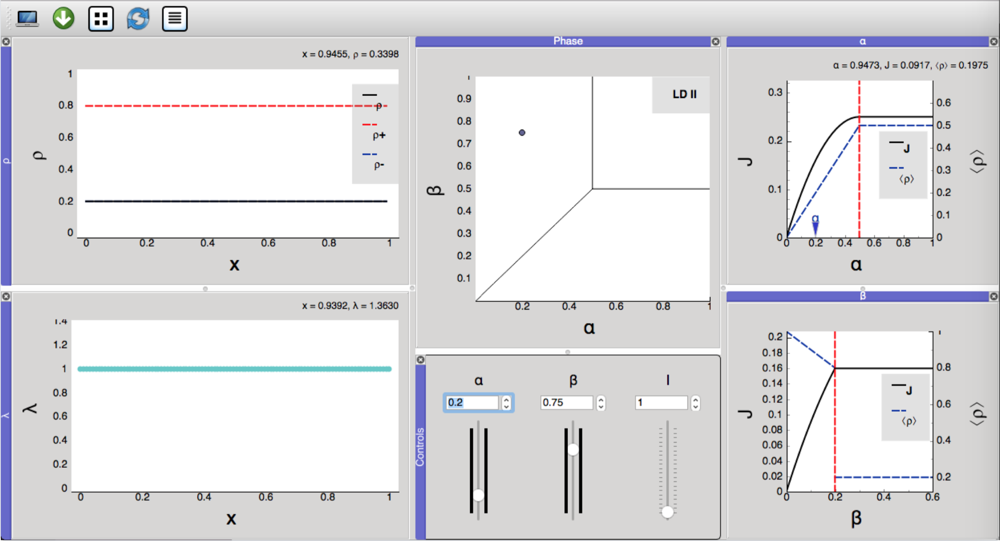
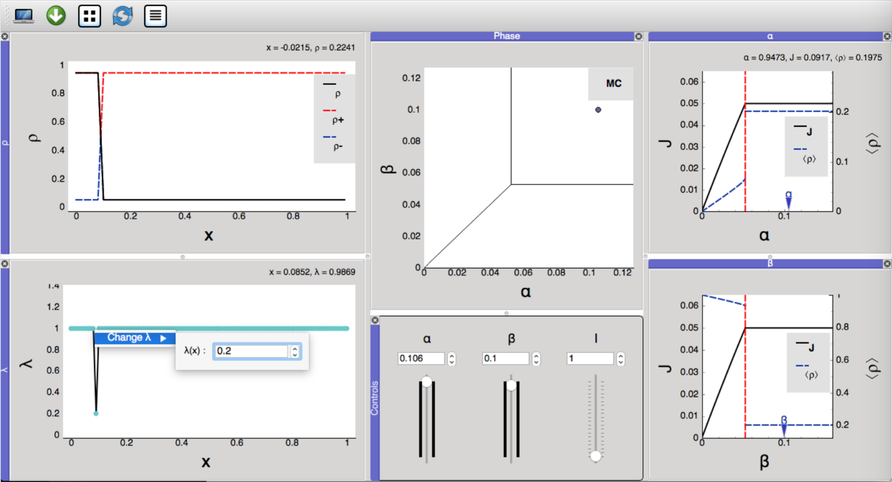
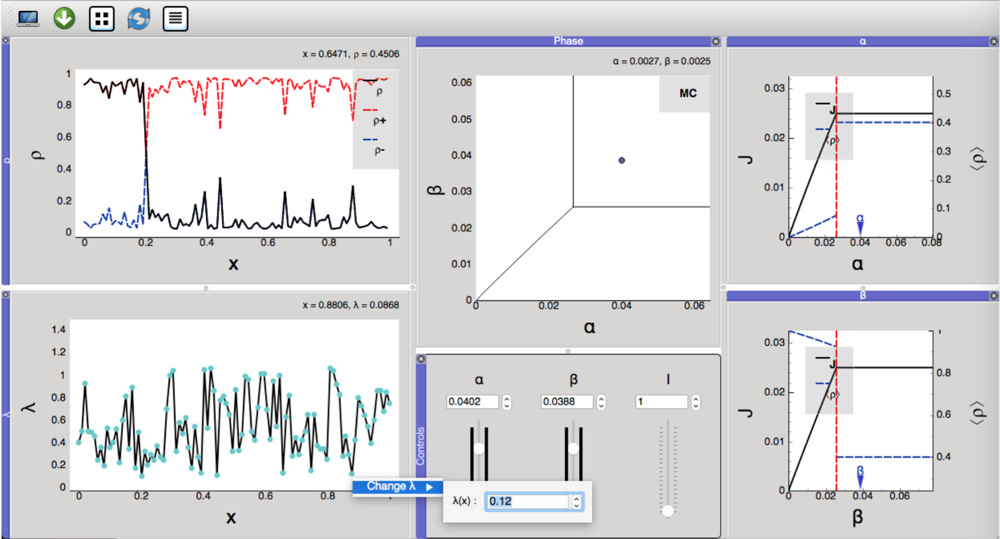

# EGGTART
EGGTART (**E**xtensive **G**UI **g**ives **T**ASEP-realization in **r**eal-**t**ime) is a software package that provides a visualization of the dynamics associated with the generalized Totally Asymmetric Simple Exclusion Process (TASEP).

## Installation
EGGTART has been developed in Python 3.6. and uses the numpy and pyqtgraph packages, which require pyqt4 or pyqt5. For ease of installation, we provide an executable version of the software that does not require Python or the required add-on packages to be installed. To launch EGGTART, simply download the version developed for your operating system, and double-click the corresponding executable file. Currently, we provide distributions of EGGTART for Mac OS X, Linux (Ubuntu 18.04) and Windows, with most extensive testing conducted on Mac. A separate open-source version will be made available in the near future. 

## Tutorial
Here is a simple tutorial to demonstrate the various features of EGGTART and the fundamental properties of the TASEP:

1. To begin with, let us visualize the original homogeneous 1-TASEP model. Load the input file called 
```
homogeneous_rates.csv
```
which should result in this setup:


The  panel (bottom left) displays the hopping rates, while the top left panel visualizes the bulk density. Default parameters  (entrance rate),  (exit rate) and  (particle size) are displayed in the bottom middle panel, with a ball in the top middle panel indicating the current  value in the phase diagram. EGGTART informs us that for this particular configuration, the system follows dynamics of the MC (maximal current) regime, since both  and  are above their respective critical values associated with phase transitions (shown by red lines in the right panels). The right panels display correctly that the current and average density are constant in this region.

2. We change the entrance rate  by typing a new value (0.2) in the left box located in the middle bottom panel (it is also possible to drag the ball located in the phase diagram):



As a result, the ball in the phase diagram panel has now moved to the LD region and in the top right panel, and the  flag has moved past the critical red line (representing a phase boundary) correspondingly. The single  branch in the  panel has split into a lower and upper one, the fomer of which is picked by the solution to our hydrodynamic limit (whence, low density).

3. To visualize the HD regime, we modify  to 0.1 (proceeding as before, but adjusting values in the middle box instead of the left one):


The density has now switched to the upper branch, with the relative roles of  and  with respect to their critical values reversing in the top and bottom right panels.

4. We now introduce _defects_ or _slow bonds_ into our jump rates. To do so, we right-click on any point of the  plot and decrease its value (to, say, 0.2):



This reveals the branch switching phenomenon visible in MC: both solution branches now co-exists, with  transitioning from high to low density precisely at the defect location.  Moreover, the reduction the dynamical range of _J_ has is clearly visible.

5. To visualize the impact of more extensive rate heterogeneity, we load the input file
```
heterogeneous_rates.csv
```
which will yield the following interface:


The role of the defect location in our previous example is now taken on by the site of minimal elongation rate: it acts as bottleneck to the global current and forms the separator between high and low densities. Consequently, changes of its location can have dramatic effects on transport efficiency and thus deserve careful study:



6. In addition to the role of , EGGTART transparantly illustrates a dependence of the system's summary statistics on  and  that was not discernible in the homogeneous or slow-bond settings: Transitions in the phase diagram critically depend on  and  to the extent that  and  are no longer symmetric, and the previously linear HD-LD separtion has turned non-linear.


7. Finally, we increase the value of the particle size  to see how it modifies the shape of the LD-HD phase boundary and decreases densities, currents, and critical values of  and :


Please consult the user manual "EGGTART_User_Manual.pdf" for further details.
  
Dan D. Erdmann-Pham, UC Berkeley\
Wonjun Son, Columbia University\
Khanh Dao Duc, University of British Columbia\
Yun S. Song, UC Berkeley
