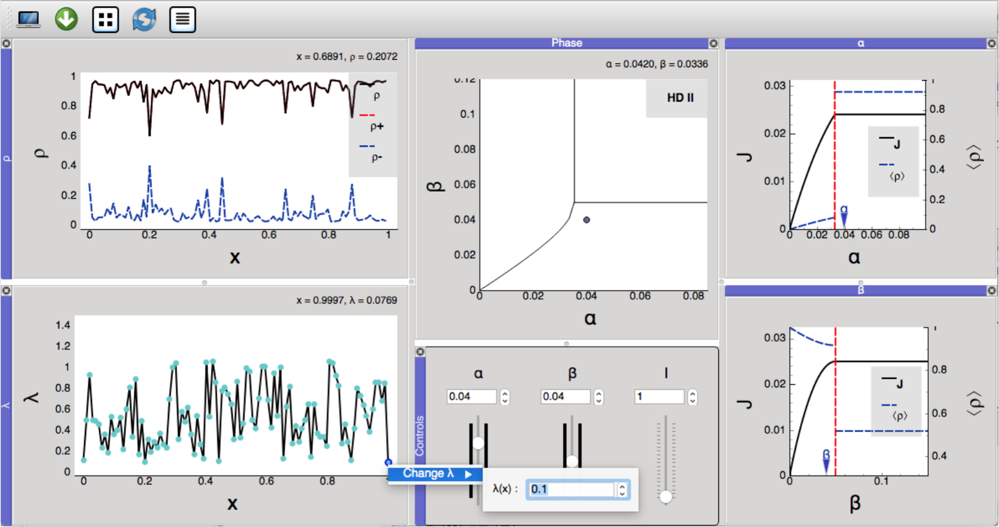
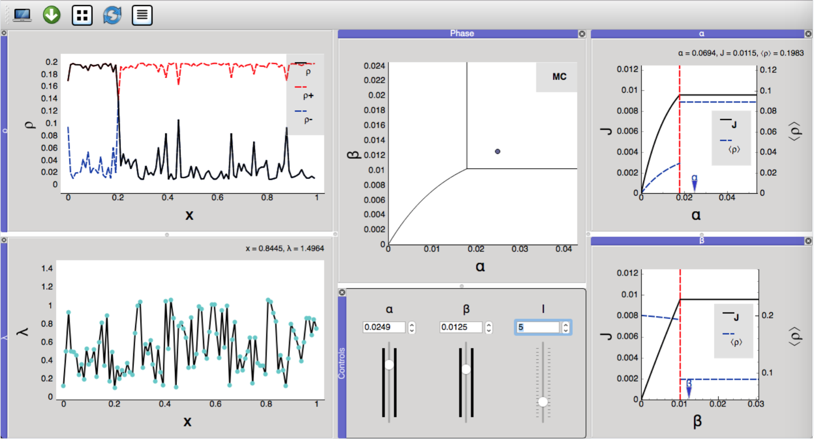

# EGGTART
EGGTART (**E**xtensive **G**UI **g**ives **T**ASEP-realization in **r**eal-**t**ime) is a software package that provides a visualization of the dynamics associated with the generalized Totally Asymmetric Simple Exclusion Process (TASEP).

## Installation
EGGTART has been developed in Python 3.6. It uses the packages numpy and pyqtgraph, which require pyqt4 or pyqt5. For ease of installation, we provide an executable version of the software that does not require having Python and the required add-on packages installed. To launch EGGTART, simply download the version developed for your operating system, and double-click the corresponding executable file. A separate open-source version will be made available in the future. We provide different versions of EGGTART for Mac OS X, Linux (Ubuntu 18.04) and Windows, with most extensive testing conducted on Mac.

## Tutorial
Here is a simple tutorial to demonstrate the various features of EGGTART and the fundamental properties of the TASEP:

1. To begin with, let us visualize the original TASEP model. Load the input file called 
```
homogeneous_rates.csv
```
which should result in this setup:


The  panel (bottom left) displays the hopping rates. In the top left panel, you can visualize the bulk density.  Default parameters  (entrance rate),  (exit rate) and  (particle size) are displayed in the bottom middle panel. In the top middle panel, a ball indicates the current  value in the phase diagram. One can see that the dynamics followed here is the MC (maximal current) regime, where both  and  are above their respective critical values associated with phase transitions (shown by red lines in the right panels). As the parameters are in the maximal current regime, one can also notice in the right panels that the current and average density are constant in this region.

2. Change the entrance rate  by typing a new value (0.2) in the left box located in the middle bottom panel (it is also possible to drag the ball located in the phase diagram):


As a result, the ball in the phase diagram panel has now moved to the _LD_ region and in the top right panel, the  flag is now on the left side of the critical red line. Instead of having a single branch of solutions, there are now two branches in the  panel, such that the solution of the hydrodynamic limit takes the lower one (with lower density).

3. To visualize the HD regime, modify  to 0.1 (same as in the previous step, with the middle box instead of the left one):


The density has now switched to the upper branch, while the position of  with respect to the critical line (shown in red) is reversed in the bottom right panel, and likewise for  in the top right panel.

4. We now introduce some _defect_ in the rates. Right click on any point of the  plot and decrease its value (e.g. 0.2):


In the MC regime, one can now notice that two branches of solution co-exist, with  starting from the upper one before switching to the lower one at the defect location.  Moreover, the range of _J_ has decreased significantly.

5. To visualize the impact of the rate heterogeneity, load the input file called\break 
```
heterogeneous_rates.csv
```
which will yield the following interface:


At positions where the hopping rate function  achieves the minimum, the density switches between the two branches.  Therefore, changing these locations can drastically affect the density over the whole lattice:


6. The phase transitions from LD to HD also depend on the value of  at the boundaries of the lattice. By changing  or , one can notice that the separation between LD and HD in the phase diagram gets non-linear.



7. Finally, increase the value of the particle size  to see how it decreases the density, current, and critical values of  and , and also modifies the shape of the LD to HD phase separation:



Please consult the user manual "EGGTART_User_Manual.pdf" for further details.
  
Dan D. Erdmann-Pham, UC Berkeley\
Wonjun Son, Columbia University\
Khanh Dao Duc, University of British Columbia\
Yun S. Song, UC Berkeley
